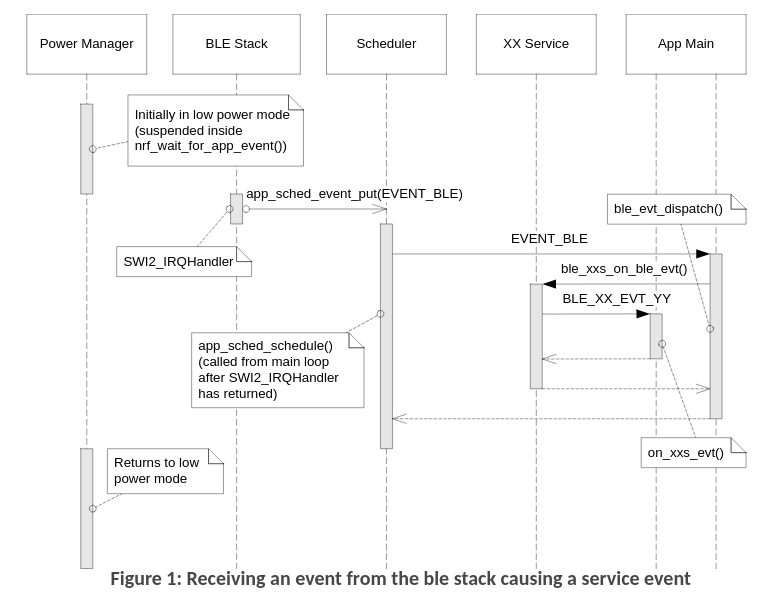
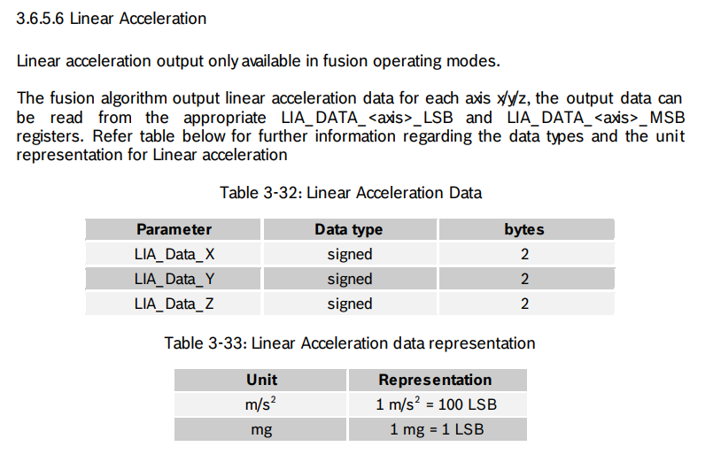
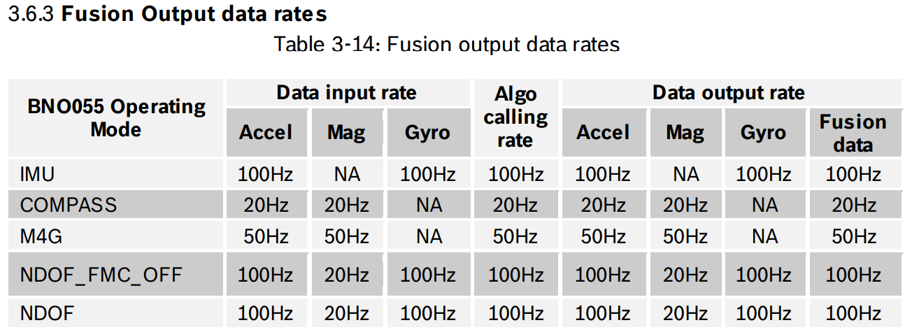
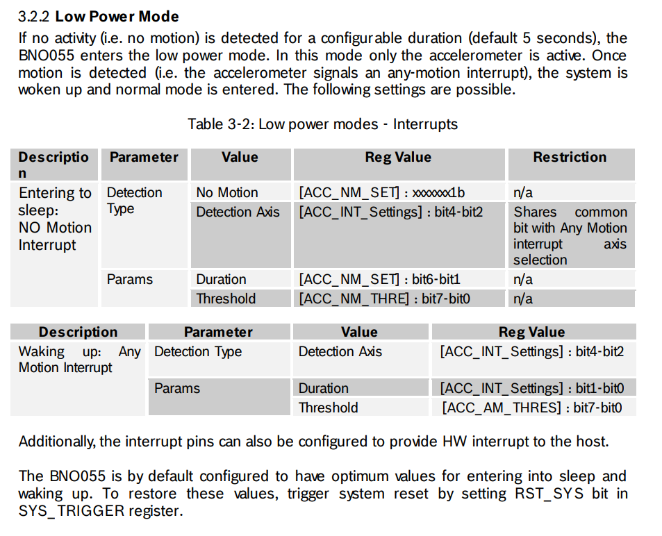
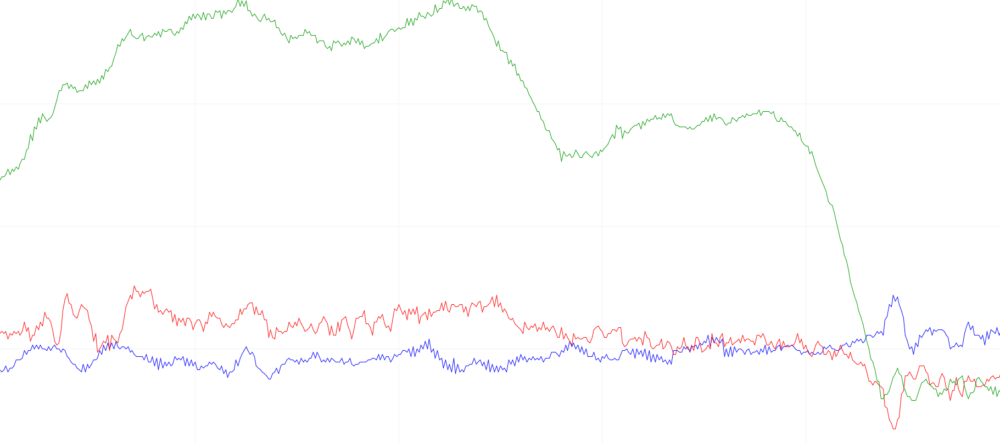

# carmind

Car parking spot reminder

## Nordic API

[BLE Docs](https://infocenter.nordicsemi.com/index.jsp?topic=%2Fsdk_nrf5_v16.0.0%2Fexamples_ble.html&cp=6_1_4_2j)
[Peripheral Docs](https://infocenter.nordicsemi.com/index.jsp?topic=%2Fsdk_nrf5_v16.0.0%2Fexamples_hw_peripheral_devices.html&cp=6_1_4_6)
[API Docs](https://infocenter.nordicsemi.com/index.jsp?topic=%2Fsdk_nrf5_v16.0.0%2Fmodules.html&cp=6_1_6)
[Data Structure Docs](https://infocenter.nordicsemi.com/index.jsp?topic=%2Fsdk_nrf5_v16.0.0%2Fusergroup0.html&cp=6_1_7)
[Scheduler Example](https://infocenter.nordicsemi.com/index.jsp?topic=%2Fsdk_nrf5_v16.0.0%2Flib_scheduler.html)

NOTE: Good examples to look at: Proximity Application, Immediate Alert Service, Beacon Transmitter Sample Application, Eddystone Beacon

The program is callback heavy and uses a pub/sub model to know who to call when events happen entities like BLE services and BLE events may allow users to register callbacks. It's also pretty macro-heavy and the main file is usually pretty big

The SoftDevice has its own stack and changing its config parameter may change the size so make sure to check if the current size is correct

## Phone App

### General Flow

Future work if have time is to automatically download maps when user wants to go somewhere using integration to things like Google Maps API

Use Navigation Drawer Activity, 3 tabs:

- Current: Show current spot including parking location, detailed parking position like floor, section, and stall number or proximitiy from a landmark
- Archive: Search for past parking position using filter like dates, parking location
- Edit: Allow for config like adding more maps

### BLE

[Nordic Android BLE Connection Library](https://github.com/NordicSemiconductor/Android-BLE-Library)
[Nordic Android BLE Scanner Library](https://github.com/NordicSemiconductor/Android-Scanner-Compat-Library)

## Power Calculations

[BLE Advertising](https://www.argenox.com/library/bluetooth-low-energy/ble-advertising-primer/)

The BNO055 has a pretty high power consumption(400 uA at lower power mode), so it makes more sense to use the BLE whenever possble for same functionality(currents on order of 50 uA). Although note that timing change results in non-linear power change to optimize properly

BLE calculation figure comes from Nordic power calculator, assuming external crystal. These figure may change drastically since iOS and Android also has guideline regarding BLE timing

There should be 2 geofences, one for when we got to the parking lot and one where we are near the parking lot, the near one will trigger about 2 minutes before we get there and start scanning for nrf52 and do all connection and initialization there

- 2.9uA for connectable advertising with interval 10s: Used for app to connect to nrf52

## Sensor Notes

BNO055 constantly calibrates itself, at power-on, the calibration is 0, and it is advised to not trust values until the calibration value changes

### Electrical Connection Notes

TODO: Use EasyDMA if possible

Uses TWI0 module

### Operation Mode

At boot, is in configuration mode, to get data need to change to either fusion or non-fusion mode. The mode of interests are NDOF(9 degrees of freedom) and NDOF_FMC_OFF, the FMC_OFF one has fast magnometer calibration off and thus has lower accuracy but also lower power consumption. There are also other modes but they don't use all 3 sensors.

The sensor has a fusion mode which are basically pre-set settings for various sensors in the DOF, sensors like accelerometers will have a more limited set of options when in fusion mode since the pre-set already fixes a couple of options

### Data Output

All types of data is 2 bytes on each axis

Linear acceleration is acceleration without the gravity component, the gravity component can be separtely obtained

Heading 0 is the heading that it was facing at power-on so will change if the position is not consistent

Data remains extremely stable, if the sensor is not moving, its data shouldn't drift by more than the last sig fig

Unit Table:

Orientation convention:

Fusion output data rate:

Axis can be reconfigured

### Power Mode

### Interrupt

Interrupt is rising edge. Configured to detect starting motion and no-motion with configurable thresholds, gyro high rate, any-motion

## Sensor Concept Notes

The BNO055 has built-in sensor fusion already that takes in raw acceleration, gyro and magnetometer and spit out oritentation and acceleration in separate components like gravity and linear.

[FreeScale IMU Data Processing Guide](https://cache.freescale.com/files/sensors/doc/app_note/AN3461.pdf)

[Sample AHRS Implementation](https://x-io.co.uk/open-source-imu-and-ahrs-algorithms/)

## Sensor Obsevation Notes

When car is on but not moving, orientation remains stable other parameter noise behaviour seems a littl higher

Linear acceleration very susceptible to vibration of surface, reading will jump when users do things like moving around the car, or simply tapping on the seats

### Linear Acceleration Graph

Straight Acceleration with braking:

U-turn

Turn 

Turn perpendicular to original axis

### Gyro Graph

90 degree turn

Straight run

## Credits

[Bosch BNO055 driver](https://github.com/BoschSensortec/BNO055_driver)
